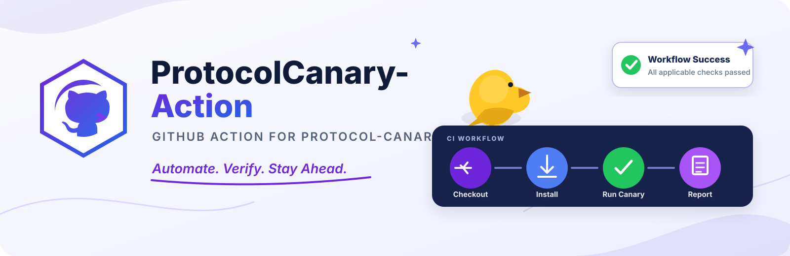

# ProtocolCanary-Action



[](https://github.com/StellarCanary/ProtocolCanary-Action/actions/workflows/ci.yml) [](https://github.com/StellarCanary/ProtocolCanary-Action/releases) [](LICENSE)

The official GitHub Actions integration for [Stellar Protocol
Canary](https://github.com/StellarCanary/Protocol-Canary). It makes Stellar
protocol compatibility testing a normal part of GitHub CI.

[Documentation](https://stellarcanary.github.io/Protocol-Canary/) | [Protocol-Canary](https://github.com/StellarCanary/Protocol-Canary) | [Fixtures](https://github.com/StellarCanary/ProtocolCanary-Fixtures)

## What it does

This Action is a thin wrapper around the real `stellar-canary` CLI. It does
not know what CAP-83 or CAP-85 mean, does not reimplement XDR/RPC/Soroban
testing, and never reinterprets a compatibility result the CLI didn't
report. It:

1. installs the requested `Protocol-Canary` version (from source, pinned —
   see [Installation & integrity](#installation--integrity));
2. runs `stellar-canary check --format json` with your inputs;
3. publishes a GitHub job summary and (optionally) annotations from that
   JSON;
4. optionally uploads the JSON report as a workflow artifact;
5. passes or fails the job according to Canary's own exit code — never a
   result the Action computed itself.

All compatibility logic lives in
[`StellarCanary/Protocol-Canary`](https://github.com/StellarCanary/Protocol-Canary).
Canonical fixtures live in
[`StellarCanary/ProtocolCanary-Fixtures`](https://github.com/StellarCanary/ProtocolCanary-Fixtures).

## Quick start

```yaml
- uses: actions/checkout@v4
- uses: StellarCanary/ProtocolCanary-Action@v1
  with:
    protocol: "28"
```

This snippet is not runnable on its own: `fixtures-dir` defaults to
`fixtures`, relative to the job's working directory, and a freshly
checked-out project normally has no `fixtures/` directory, so there is
nothing for Canary to check. Either point `fixtures-dir` at your own
fixtures or check out a fixtures pack first, as
[`examples/protocol-28.yml`](examples/protocol-28.yml) does.

See [`examples/`](examples/) for the complete, runnable workflows —
including that Protocol 28 one, which checks out the real
`ProtocolCanary-Fixtures` pack and sets `fixtures-dir` to match — and for
one that runs on a self-hosted runner
([`examples/self-hosted.yml`](examples/self-hosted.yml)).

## Example workflow

```yaml
name: Stellar Compatibility

on:
  pull_request:
  push:
    branches: [main]

permissions:
  contents: read

jobs:
  compatibility:
    runs-on: ubuntu-latest
    steps:
      - uses: actions/checkout@v4
      - uses: StellarCanary/ProtocolCanary-Action@v1
        with:
          protocol: "28"
```

## Inputs

| Input | Description | Default |
|---|---|---|
| `protocol` | Target Stellar protocol version (`--protocol`). | (from `.stellar-canary.toml`, or 28) |
| `config` | Path to `.stellar-canary.toml` (`--config`). Fails clearly if the given path does not exist. | (CLI default lookup) |
| `network` | Network for live RPC/Soroban checks (`--network`). | `testnet` (CLI default) |
| `rpc-url` | Stellar RPC endpoint (`--rpc-url`). Must be `https://`, or `http://localhost`/`127.0.0.1` for local development. | (none) |
| `fixtures-dir` | Path to a directory of fixtures, e.g. a checkout of `ProtocolCanary-Fixtures` (`--fixtures-dir`). | `fixtures` |
| `version` | `Protocol-Canary` version to install, without a leading `v`. Pinned — never tracks `main`. | `0.1.1` |
| `upload-report` | Upload the JSON report as a workflow artifact. | `true` |
| `annotations` | Emit GitHub annotations for failures/warnings/errors. | `true` |
| `timeout-minutes` | Maximum time to let Canary run before it is terminated. Bounds only the Canary process, not the whole job — see [Timeouts](#timeouts). | `15` |

There is deliberately no `format` input: the Action always requests
`--format json` from the CLI (the only way it can build the summary and
annotations), and never invokes Canary twice to get a second format.

## Outputs

| Output | Description |
|---|---|
| `status` | `pass`, `warning`, `fail`, `error`, or `execution-failed` (the Action's own value when Canary could not produce a report at all — see below). |
| `passed` | Number of checks that passed. |
| `warnings` | Number of checks that produced a warning. |
| `failures` | Number of checks that failed a compatibility assertion. |
| `errors` | Number of checks that could not complete due to an execution error. |
| `report` | Absolute path to the generated JSON report file. Only set when Canary produced output to parse; empty/unset on an execution failure (`status` `execution-failed`). |

## How failures appear

The Action distinguishes two different kinds of "red":

- **A compatibility failure** — Canary ran successfully and found a real
  incompatibility. `status` is `fail` (or `warning`/`error`); the job
  summary shows a per-surface table and the specific failing test IDs;
  annotations point at each one.
- **An execution failure** — Canary could not be installed, could not run,
  timed out, or produced output that could not be parsed as a report.
  `status` is `execution-failed`; the summary says "Protocol Canary could
  not be executed" with the actual diagnostic, never a fabricated
  compatibility message.

A separate failure — the job summary itself failing to publish — is
reported as "Failed to publish Canary summary," distinct from both of the
above.

Annotations from this Action are workflow-level only: no fixture in the
report schema carries a file/line location, so they appear in the
workflow run's Checks output and logs, never inline on a pull request's
file diff the way file-scoped annotations from other tools do. The Action
never fabricates a location.

## Artifacts

When `upload-report: true` (the default), the JSON report is uploaded as a
workflow artifact named `stellar-protocol-canary-report`. Artifact upload
is always auxiliary: if it fails, the underlying compatibility result is
unaffected, and a warning is logged rather than the job failing on that
account alone.

GitHub requires artifact names to be unique within a workflow run, so a
second invocation — a matrix leg, or a second Action step checking another
network or protocol — would otherwise collide with the first. The Action
handles this automatically: **the first invocation keeps the stable name
`stellar-protocol-canary-report`**, and a later invocation whose upload is
rejected because that name is taken retries under a suffixed name derived
from the inputs that distinguish it, for example
`stellar-protocol-canary-report-protocol-28-network-testnet`. (When no
inputs distinguish the invocation, a short unique suffix is used instead.)

This means existing single-step workflows keep the exact artifact name
they have always had, while multi-invocation workflows collect one report
per invocation instead of silently dropping every upload after the first.
Downloading a specific report from a multi-invocation run therefore means
matching the suffix — either the protocol/network/config it checked, or the
generated unique suffix when the invocations share the same inputs.

## Installation & integrity

`Protocol-Canary` does not yet publish prebuilt release binaries or
checksums (see its own `docs/json-report-contract.md` and this Action's
[SECURITY.md](SECURITY.md)). This Action installs it with `cargo install
--git`, pinned to the immutable commit the requested version's tag
resolved to at run time (falling back to the tag itself, with a warning, if
that resolution fails) — see `src/version.ts` and `src/canary.ts`. This
requires a Rust/Cargo toolchain on the runner; GitHub-hosted Ubuntu
runners include one by default. A self-hosted or non-Ubuntu runner must
install one before this Action runs — see
[`examples/self-hosted.yml`](examples/self-hosted.yml) for a complete
workflow that does this with `dtolnay/rust-toolchain` ahead of invoking
this Action. A successful build is cached (best-effort; never required for
correctness) using `actions/cache`.

## Versioning

This repository follows semver and publishes a floating `v1` tag pointing
at the latest `v1.x.y` release, per standard GitHub Actions convention. The
release workflow moves that tag automatically when a new `vX.Y.Z` tag is
pushed (and only ever forwards, never backwards), so `@v1` always resolves
to the newest `v1.x.y` release. The `version` input is unrelated to this
Action's own version: it selects which `Protocol-Canary` release to install
and run.

```yaml
- uses: StellarCanary/ProtocolCanary-Action@v1 # floating major tag
- uses: StellarCanary/ProtocolCanary-Action@v1.2.3 # pinned to an exact release
```

Prefer `@v1` to receive fixes automatically within `v1`; pin to an exact
tag like `@v1.2.3` when you need full reproducibility (consistent with the
`version` input, which is pinned and never tracks `main`).

### Supported Canary versions

| Action | Protocol-Canary |
|---|---|
| v1 | `0.1.1` (default; `0.1.0` also installable, but predates the `ContractExecutable` XDR type two current Protocol 28 fixtures require, and its report predates the `counts` field) |

This table will grow as `Protocol-Canary` cuts new releases; a
`schemaVersion` change to its JSON report is a breaking change for this
Action and will be called out here explicitly.

## Limitations

- This Action depends on a compatible `Protocol-Canary` release; see the
  version table above.
- Network-dependent checks (RPC, Soroban) can fail if the configured RPC
  endpoint is temporarily unavailable — that is a real result, not an
  Action bug.
- A passing result means the declared compatibility assertions for the
  configured protocol passed against your configured dependencies and RPC
  endpoint. It is not a guarantee against every possible incompatibility,
  and does not replace testing against a real deployment.

## Security

See [SECURITY.md](SECURITY.md). In short: no private keys, no transaction
submission, `contents: read` is sufficient permission, and Canary
arguments are always passed as an array — never interpolated into a shell
string.

## Code of Conduct

See [CODE_OF_CONDUCT.md](CODE_OF_CONDUCT.md).

## Maintainers & Community

**Maintainer:** [@Hollujay](https://github.com/Hollujay) — reachable via
this repository's GitHub profile; no other official contact channel is
published for this project.

**Community:** There is no dedicated community channel yet. Contribution
and discussion happen through GitHub
[issues](https://github.com/StellarCanary/ProtocolCanary-Action/issues) and
pull requests on this repository.

**Contributors:**

[](https://github.com/StellarCanary/ProtocolCanary-Action/graphs/contributors)

## Development

See [CONTRIBUTING.md](CONTRIBUTING.md).

## License

[Apache-2.0](LICENSE)
